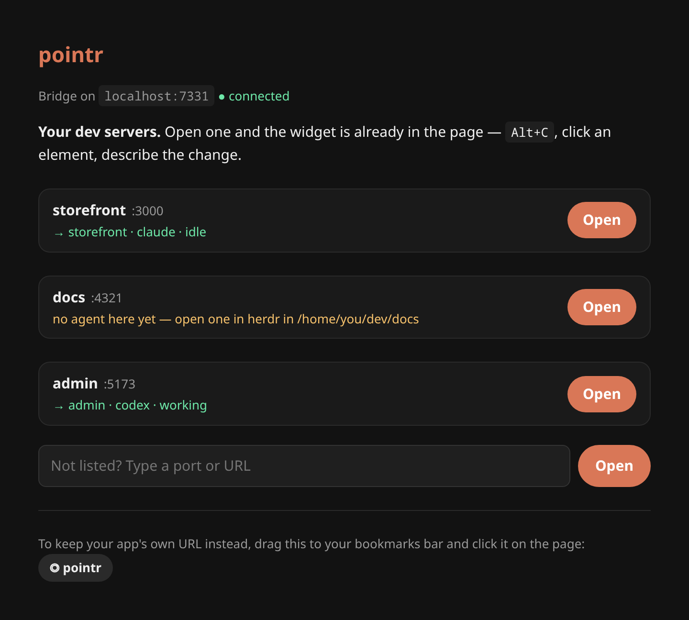

# pointr

[](https://herdr.dev)
[](#install)
[](LICENSE)

**Point at what's wrong in your browser. The agent you already have open answers right there.**

Click an element in your local app and leave a comment — a change to make, or a question.
It lands in the coding agent working on that project, with the React component and its
ancestry, props, a selector, recent console errors and an optional screenshot, and the
agent's answer comes back as a thread pinned to that element. A [herdr](https://herdr.dev)
plugin; works with any agent herdr detects.


## Install

```bash
herdr plugin install aristeoibarra/herdr-pointr
```

Needs herdr 0.9.0+ on Linux or macOS — nothing else, and nothing in the browser.

## Use

**1. Open `http://localhost:7331`** — bookmark it. It lists the dev servers running in
your projects and which agent each one sends to.



**2. Click Open.** Your app opens on its port + 10000 (`:3000` → `:13000`) with the
widget already in the page. Hot reload, API calls and assets work as usual. Ctrl-clicking
a localhost URL in herdr does the same.

**3. Press `Alt+C`, click an element, write a comment, send.** It goes to the agent
working in that project's directory and the answer shows up in a thread pinned to the
element. If the agent is busy, the comment waits in pointr until it is free — you can still
cancel it or send it anyway. Reply in the thread to keep going, resolve it when you are
done; the list in the dock has every thread of the project, open and resolved. If no agent
is open there, the page warns you; if several are, it asks.

## What the agent gets

```text
[pointr] Browser comment · thread t_ab12cd

Comment: Make the avatar bigger and move the tags under the name.
Page: http://localhost:3000/
Screenshot: /tmp/herdr-pointr/shot-1754112000-a1b2c3.png

Element 1: <ProfileCard> (react)
- Component path: ProfileCard › ProfileGrid › AppShell
- Selector: article:nth-of-type(2)
- Props: name="Idris Okonkwo", role="Product Designer", tags=Array(1)
- Text: "IOIdris OkonkwoProduct Designer"
- HTML: <article class="card">…

When you are done, answer in the browser thread — the user reads it next to the element, not in this terminal:
/home/you/.local/share/herdr/plugins/pointr/dist/pointr reply --port 7331 t_ab12cd <<'POINTR'
<2–4 sentences, the answer first>
POINTR
- Asked for a change: make it, then reply with what you changed.
- Asked a question or for your opinion: reply without editing any files.
```

The agent answers by running that command, which posts the reply to the thread; replies
you write in the thread go back to the same agent with the conversation so far.

React 19 no longer exposes `file:line`, so the component ancestry is what lets the agent
find the file. For exact locations, mount
[`examples/babel-plugin-data-source.cjs`](examples/babel-plugin-data-source.cjs) dev-only.

## Good to know

- **Settings** (destination, shortcut, screenshot framing) are behind the gear in the
  comment list, or the destination chip on a comment. The bubble in the dock hides the pins.
- **The first reply asks permission** in Claude Code, since it runs a shell command.
  `pointr doctor` prints the allow rule (`Bash(<path>/pointr reply:*)`) to skip that.
  An agent sandboxed without network access cannot reach the bridge to reply.
- **Threads** are kept per project in the plugin's state dir (`threads/`); resolved ones
  are dropped after 30 days. The page at `localhost:7331` shows each project's new replies.
- **Keeping your app's URL** — for OAuth callbacks registered on `:3000`, say — use the
  bookmarklet on `localhost:7331`, or render [`examples/Pointr.tsx`](examples/Pointr.tsx)
  in your root layout.
- **Wrong destination?** `http://localhost:7331/debug?port=3000` shows why it chose it.
- **Commands:** `herdr plugin action invoke aristeoibarra.pointr.<action>` with `status`,
  `doctor`, `start`, `stop`, `pin` (send to the focused pane) or `unpin`.
- **Development only.** The bridge and its proxies listen on localhost and forward what
  they receive to your agent.

## Develop

```bash
git clone https://github.com/aristeoibarra/herdr-pointr && cd herdr-pointr
npm install && npm run build   # needs Go and Node; `herdr plugin link` does not build
herdr plugin link .
```

MIT
