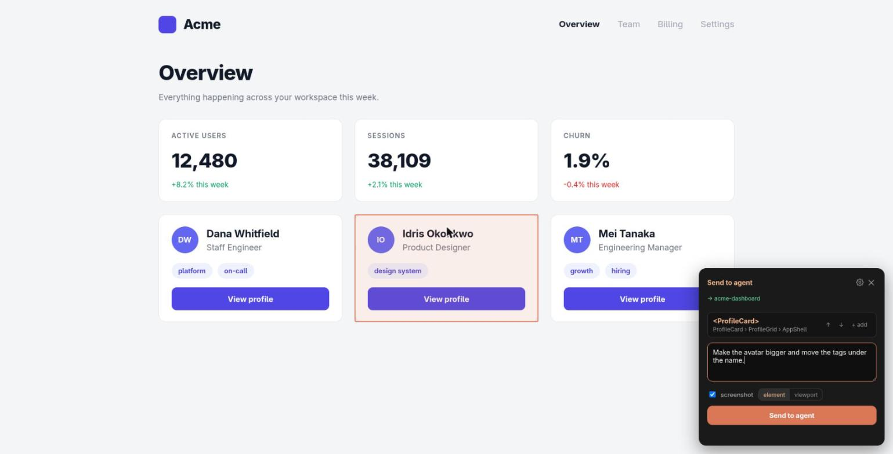
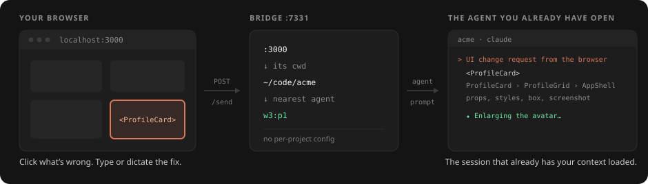

# pointr

[](https://herdr.dev)
[](#requirements)
[](LICENSE)

**Point at what's wrong in your browser. Fix it in the agent you already have open.**

Click an element, say what should change, and it lands in the prompt of the coding agent
working on that project — with the React component name and ancestry, serialized props, a
clean selector, computed styles, recent console errors, and an optional screenshot.
Nothing here drives your browser; context flows one way, from your eyes to the agent.

A [herdr](https://herdr.dev) plugin. Agent-agnostic: herdr recognises two dozen coding
agents, and pointr talks to whichever one owns the project you're looking at.



## How it works



The widget sends the page URL. The bridge reads the dev-server **port**, finds the process
listening on it, takes its **working directory**, and matches the agent working there.
Open as many projects as you like at once — no pinning, no per-project config.

Matching is tiered: exact directory, then nearest parent, then nearest child. When more
than one agent fits equally it **asks instead of guessing**, and a directory that says
nothing about which project it is — your home directory, say — is not treated as evidence
at all, on either side: a session sitting in `$HOME` contains every project you have, so
it is never allowed to win a project by containment.

After a send, the widget follows the agent's real state: working, finished, or waiting on
an approval dialog it can't answer for you.

## Requirements

herdr 0.9.0+, Node 20+, `curl` or `wget`, Linux or macOS, and a coding agent running in a
herdr pane. npm is only needed if a prebuilt bundle is unavailable (see below).

## Install

```bash
herdr plugin install aristeoibarra/herdr-pointr
```

That clones it, fetches the ~35 KB bundle CI built for that exact commit, and registers
it. If there is no such bundle — you installed in the minute after a push, or you are
offline — it builds from source with npm instead. The bridge then starts with herdr and
stays out of your way. To check it:

```bash
herdr plugin action invoke aristeoibarra.pointr.status
herdr plugin action invoke aristeoibarra.pointr.doctor
```

To hack on it, link a local checkout instead — note that `plugin link` does **not** run
the manifest's build step, so build it yourself:

```bash
git clone https://github.com/aristeoibarra/herdr-pointr && cd herdr-pointr
npm install && npm run build
herdr plugin link .
```

### Optional: a key for it

```toml
# ~/.config/herdr/config.toml
[[keys.command]]
key = "prefix+alt+p"
type = "plugin_action"
command = "aristeoibarra.pointr.pin"
description = "pointr: send here"
```

## Load the widget

Nothing to install in the browser. Open your app through pointr — for a dev server on
port 3000:

```text
http://localhost:7331/open?url=3000
```

Bookmark it, Ctrl-click the localhost URL an agent prints in herdr (below), type the port
at `http://localhost:7331`, or run `pointr open 3000`. The page opens on its port + 10000
— `localhost:3000` becomes `localhost:13000` — served by the bridge with the widget added
to each page and everything else passed through untouched: assets, API calls, hot reload. Proxies open
on demand, bind to loopback only, close after 30 idle minutes, and come back on the same
port when herdr restarts, so an open tab survives it.

The one thing that differs is the origin, and that matters if your app registers
`localhost:3000` somewhere else — an OAuth redirect URI, say — or keeps state in
`localStorage` you want to see. For those:

**Bookmarklet:** open `http://localhost:7331` and drag the button to your bookmarks bar.
Keeps your URL; misses console errors from before you click it.

**Extension:** open `brave://extensions` (or `chrome://extensions`), enable Developer
mode, **Load unpacked** → the `extension/` folder. Injects on every `localhost` page, at
your usual URL, from the first line of the app's code.

**CSP-strict projects:** copy [`examples/Pointr.tsx`](examples/Pointr.tsx) into the repo
and render it in the root layout, dev-only.

### Settings

Behind the gear in the widget's panel — on the page, where what you are
configuring actually is.

| Setting | Scope |
| --- | --- |
| **Destination** — pin an agent instead of auto-routing | per site |
| **Send on click** — off pastes for review first | global |
| **Shortcut** — defaults to `Alt+C` | global |

With the extension installed these persist in `chrome.storage` and apply live to
every open tab. Loaded through the proxy, the bookmarklet or the component they
live in the page's `localStorage` instead, which is why the settings are here and
not in the toolbar popup: those paths have no popup.

You can also pin from herdr itself: `pointr: send here` acts on the focused
pane, and `pointr: choose a destination` opens a picker.

### Ctrl-click a localhost URL

When an agent prints `http://localhost:3000` in its pane, Ctrl-click it (Control on
macOS too — terminal mouse reports cannot tell Cmd from a plain click) and herdr hands
the URL to pointr instead of the browser's default handler. The page opens through the
proxy, with the widget already injected — no extension involved.

## Daily use

`Alt+C` or the button → hover → click. Refine with **↑ parent / ↓ child**, or **+ add**
for several elements. Type the change, tick **screenshot** if it's visual, send. The panel shows **→ \<project\>** before you send, and afterwards the
status line follows the agent until it settles.

## What lands in the agent

```text
[pointr] UI change request from the browser

Request: Make the avatar bigger and move the tags under the name.
Page: http://localhost:4173/
Screenshot: /tmp/herdr-pointr/shot-1754112000-a1b2c3.png

Element 1: <ProfileCard>
- Component path: ProfileCard › ProfileGrid › AppShell
- Selector: article:nth-of-type(2)
- Props: name="Idris Okonkwo", role="Product Designer", initials="IO", tags=Array(1)
- Box: 320×160 at (430, 312)
- Key styles: display: flex; width: 320px; padding: 18px; gap: 12px;
  flexDirection: column; fontSize: 15px; color: rgb(22, 24, 29); …
- Text: "IOIdris OkonkwoProduct Designerdesign systemView profile"
- HTML:
<article class="card"><div class="row"><div class="avatar">IO</div><div class="who">…
```

Props are serialized (scalars verbatim, objects summarized) so the agent sees the data,
not just the markup. Recent console errors, uncaught exceptions and failed fetches ride
along too, buffered from page load.

Component identity is the point: React 19 dropped `_debugSource`, so there is no
`file:line` to hand over — the ancestry is what lets the agent grep straight to the file.
For deterministic locations, mount
[`examples/babel-plugin-data-source.cjs`](examples/babel-plugin-data-source.cjs) dev-only;
it stamps host elements with `data-source="src/Card.tsx:3"` and the widget picks it up.
On Next 16.2+ Turbopack loads it as an external transform at no measurable cost.

## Commands

Run through herdr as plugin actions, or directly as `pointr` if you put `dist/cli.js` on
your PATH.

| Command | What it does |
| --- | --- |
| `start` / `stop` / `status` | Manage the background bridge (default `:7331`) |
| `serve [--port N] [--project PATH]` | Run it in the foreground instead |
| `agents` | List the agents herdr can see |
| `pin [w1:p1\|--clear]` / `pick` | Choose a destination (rarely needed) |
| `open <url\|port>` | Open a dev server through the proxy, widget injected |
| `doctor` | Check herdr and port lookup |

Routing not doing what you expect? `GET /debug?port=<N>` returns the full decision trace.

## Security

Development-only. The bridge binds to `localhost`, accepts any local origin, and sends
what it receives to your agent. The proxies bind to `127.0.0.1` only, so a dev server
that is private to your machine stays that way. Run it only on a machine you control; don't expose the
port.

## License

MIT
